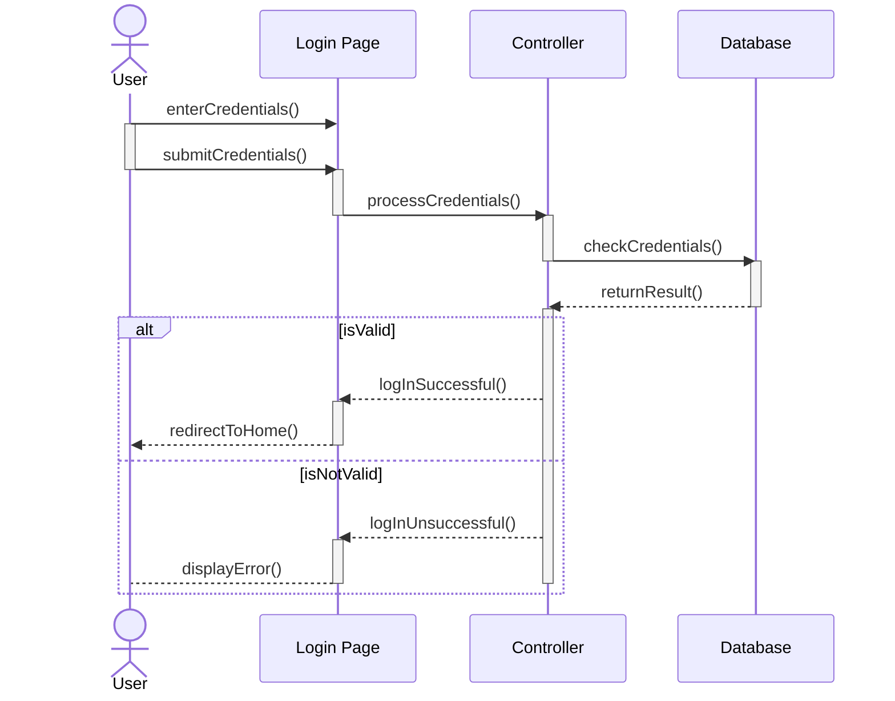
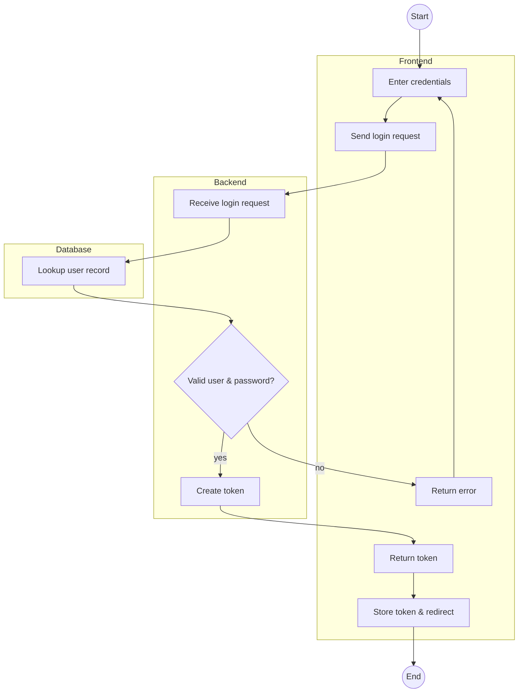
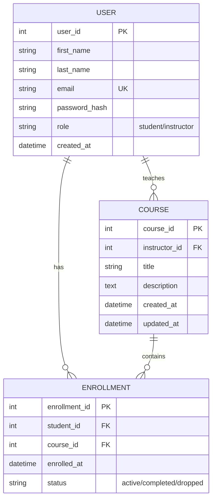
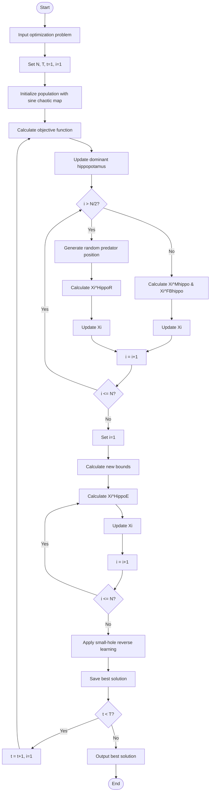

# 🧜‍♀️ Mermaid.js Sandbox


> This repository constitutes a single README file to practice Mermaid.js diagram syntax.


### I. Sequence Diagram
---
A ***simple sequence diagram*** of a Log-in use case.


### II. Process Flowchart of a Log-in Feature
---


### III. Entity Relational Diagram
---
An ***ERD*** of 3 entities (User, Course, and Enrollment)


> A complex system would require more entities such as payment, quiz, category, module, progress, etc.

### IV. Back-end Directory Structure of a Simplified Udemy-based Web Application (Vertical Slice Architecture)
---
```text
# Directory Structure: Udemy-based Web Application (Blazor, .NET Core, Mediatr)

src/
├── Features/                      
│   ├── UserManagement/
│   │   ├── Account/              
│   │   │   └── Account.cs
│   │   ├── Login/
│   │   │   └── Login.cs
│   │   ├── SwitchRole/
│   │   │   └── SwitchRole.cs
│   ├── CourseManagement/
│   │   └── Course.cs
│   ├── Enrollment/
│   │   └── Enroll.cs
│   ├── CompleteCourse/
│   │   └── CompleteCourse.cs
│   ├── Payments/
│   │   ├── Checkout/
│   │   │   └── Checkout.cs
│   │   └── Webhooks/
│   │       └── StripeWebhook.cs
├── Infrastructure/                
│   ├── Persistence/
│   │   ├── ApplicationDbContext.cs
│   │   └── Migrations/
│   ├── Email/
│   └── FileStorage/
├── Domain/                        
│   ├── Users/
│   │   ├── User.cs
│   │   └── Role.cs
│   ├── Courses/
│   │   ├── Course.cs
│   │   └── Module.cs
│   └── Shared/
│       └── ValueObjects/
├── appsettings.json
├── Program.cs
└── ../../udemy-app                 
```


#### i. Bonus Side Project: General flowchart of the Modified Hippopotamus Optimization (MHO) Algorithm.
---
MHO (Han et al., 2025) is a modified metaheuristic algorithm based on the  Hippopotamus Optimization (MHO) Algorithm (Amiri et. al, 2024), to be used for my thesis, where it is to be modified and used to solve land allocation and harvest scheduling, benchmarked against established methodology.


> Lifted from https://www.nature.com/articles/s41598-024-54910-3
