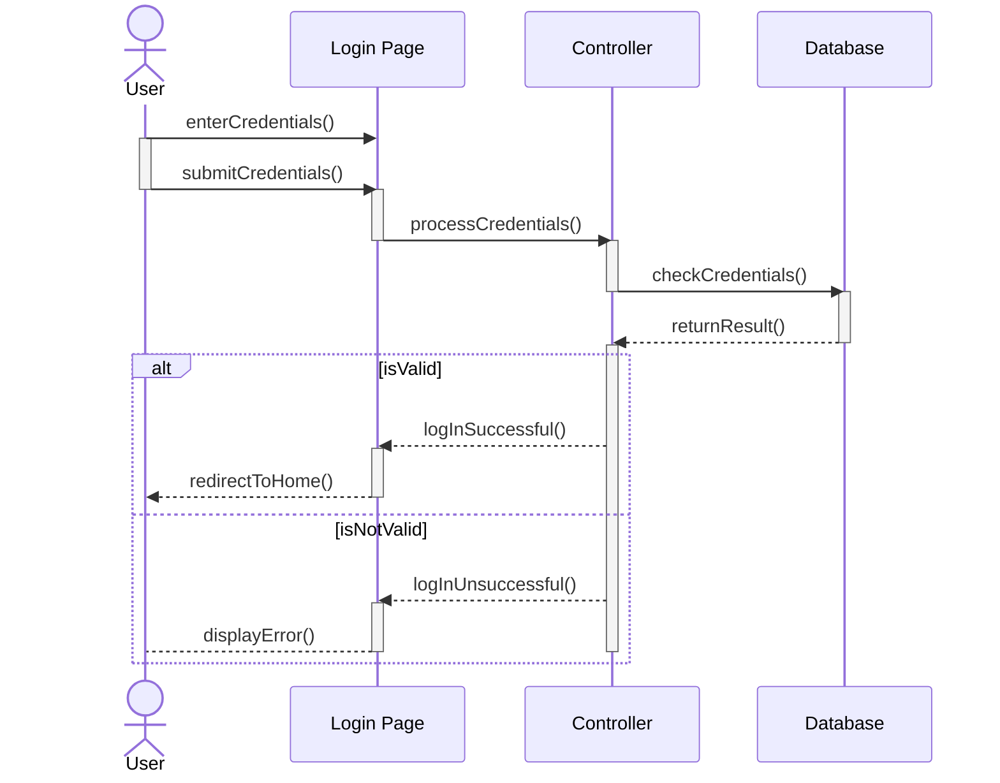
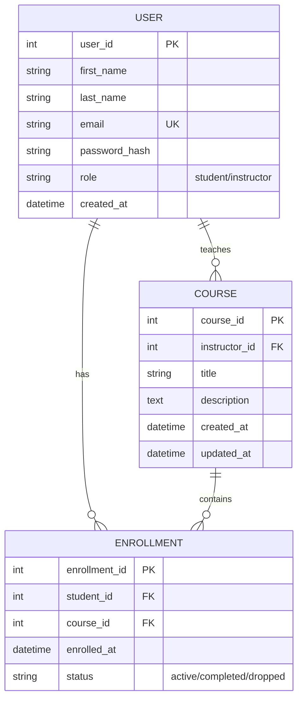

# Mermaid Diagram Example

This repository constitutes  a single README file to practice Mermaid.js diagram syntax.

### Sequence Diagram
---
A ***simple sequence*** diagram of a Log-in use case.

### Entity Relational Diagram
---
An ***ERD*** of 3 entities (User, Course, and Enrollment)
